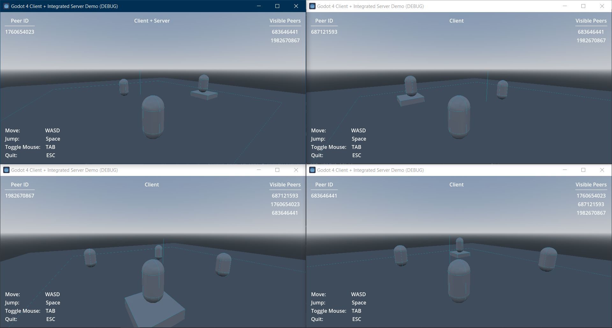

This is a simple multiplayer demo that has a client and separate server running in the same project. The client is the authority for player movement, while the server handles visibility between peers. This has been a headache to wrap my head around so hopefully it helps someone else struggling out there.

